# حسبها — مساعدك المالي الشخصي

تطبيق ويب عربي (RTL) لإدارة المال والديون والدخل والمصاريف والالتزامات.

**الفكرة:** اعرف كم تملك، كم عليك، وماذا ينتظرك.

القاعدة الذهبية: الأرقام تُحسب من محرك مالي برمجي (`Financial Engine`)، وليس من نموذج ذكاء اصطناعي.

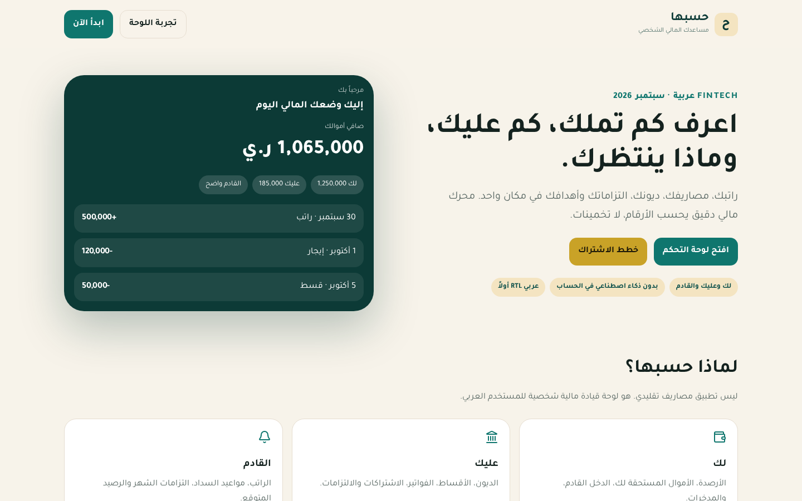

## لماذا حسبها؟

معظم تطبيقات المصاريف تعرض تاريخاً. حسبها يعرض وضعك الآن وما سيحدث لأموالك.

| لك | عليك | القادم |
| --- | --- | --- |
| الأرصدة الحالية | الديون | الراتب القادم |
| الأموال المستحقة لك | الأقساط | الإيجار والفواتير |
| الدخل والمدخرات | الاشتراكات | الرصيد المتوقع |

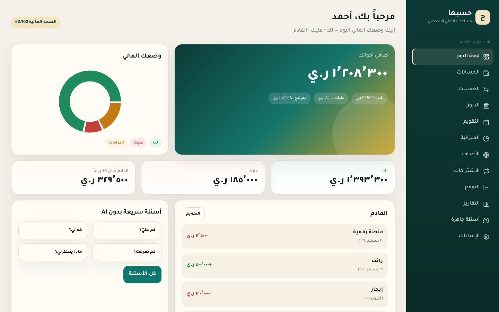

## الميزات الحالية (MVP)

- لوحة رئيسية: صافي الأموال، رسم Donut، لك / عليك / القادم
- حسابات ومحافظ مع تحويل بينها دون احتسابه مصروفاً
- مصروفات ودخل وإدخال سريع وعمليات متكررة
- ديون باتجاهين: عليك، وأموال لك، مع دفعات
- تقويم مالي للأحداث القادمة
- ميزانية حسب التصنيف
- أهداف ادخار مع خطة شهرية مقترحة
- اشتراكات وإجمالي شهري / سنوي
- توقع الرصيد وخطة توزيع الراتب
- أسئلة جاهزة بدون AI (كم عليّ؟ كم لي؟ كم صرفت؟ ...)
- قرار شراء برمجي: مناسب / ممكن مع تأثير / يفضّل التأجيل
- مؤشر صحة مالية قابل للشرح من 100
- عملات خليجية ويمنية ويورو ودولار

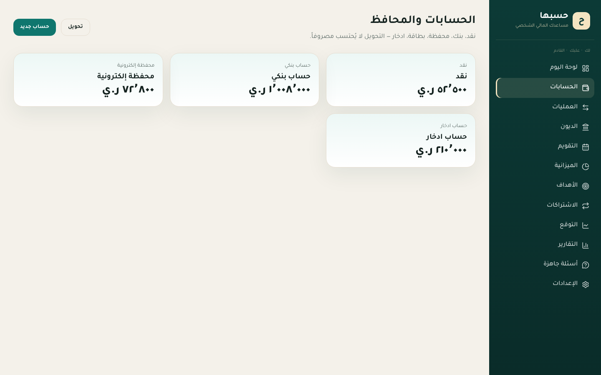

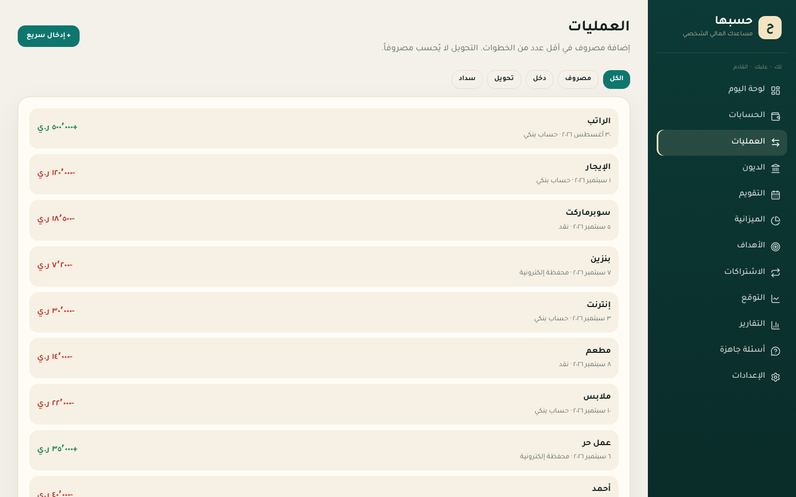

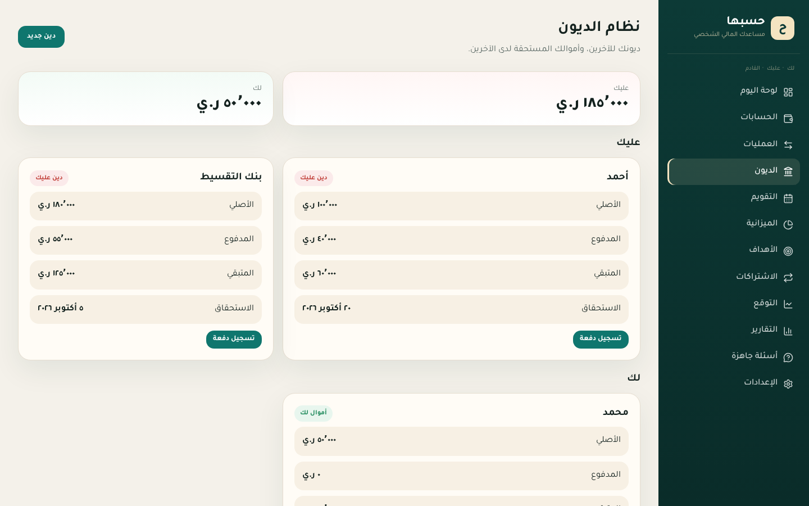

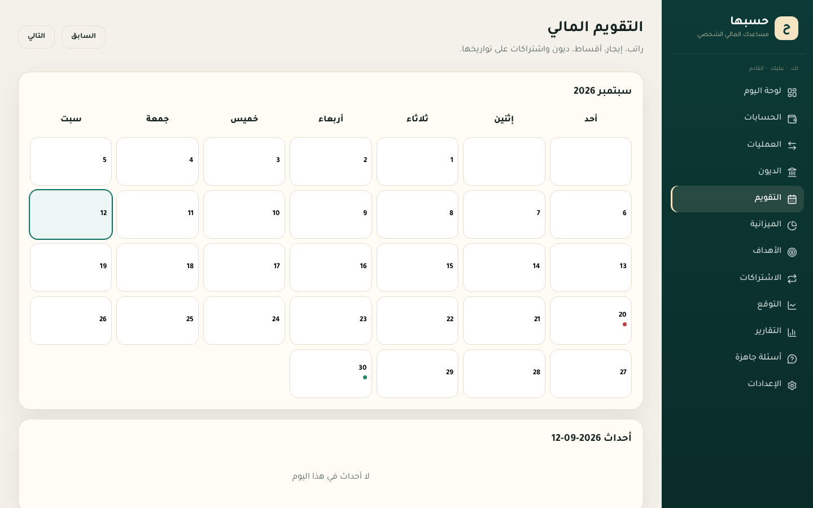

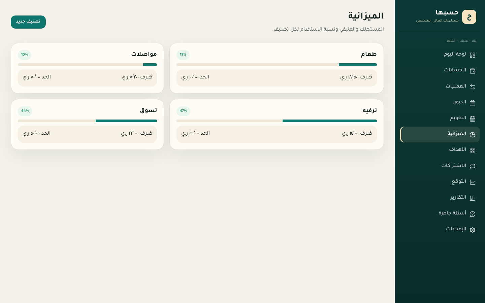

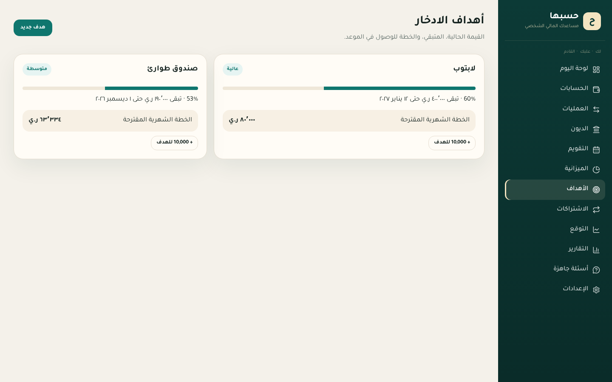

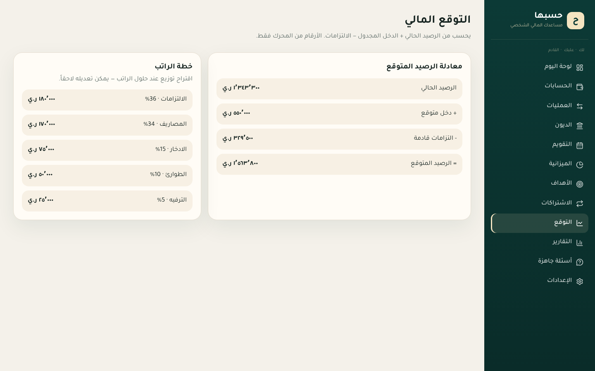

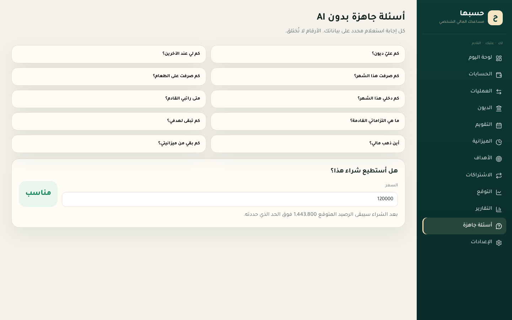

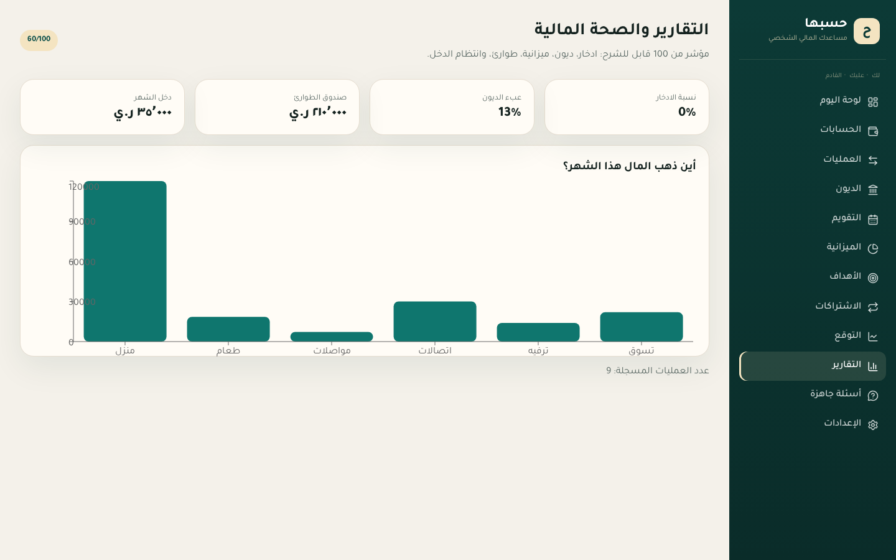

### واجهة الجوال

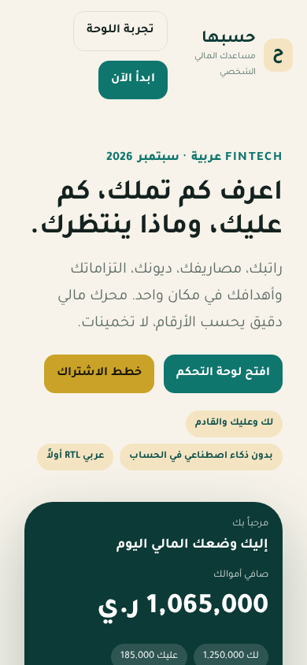

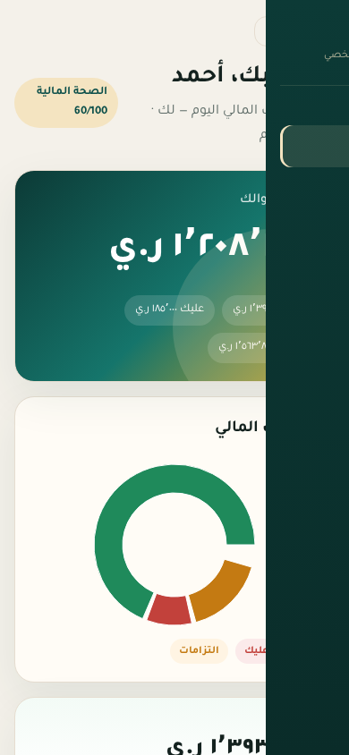

## التشغيل المحلي

```bash
npm install
npm run dev
```

ثم افتح `http://localhost:5173`

للإنتاج:

```bash
npm run build
npm run preview
```

## التقنيات

- React 19 + Vite
- React Router
- Recharts
- CSS مخصص بهوية FinTech عربية (خط Tajawal، اتجاه RTL)

لا حاجة لخادم أو قاعدة بيانات في هذا الإصدار: البيانات تجريبية داخل المتصفح عبر محرك الحسابات.

## هيكل المشروع

```text
src/
  App.jsx
  pages/          صفحات اللوحة والتسويق
  lib/
    engine.js     محرك الحسابات
    store.jsx     الحالة والبيانات التجريبية
    format.js     العملات والتنسيق
docs/screenshots/ لقطات الواجهة
```

## كيف تُحسب الأرقام؟

```text
Database
  ↓
Financial Engine
  ↓
Verified Numbers
  ↓
AI Assistant  (لاحقاً — لا يخترع الأرقام)
```

أمثلة من المحرك:

- صافي الأموال = النقد + المستحق لك − ما عليك
- الرصيد المتوقع = الرصيد الحالي + الدخل المجدول − الالتزامات خلال 30 يوماً
- الصحة المالية من نسبة الادخار، عبء الديون، تجاوز الميزانية، صندوق الطوارئ، وانتظام الدخل

## خارطة الطريق

| المرحلة | المحتوى |
| --- | --- |
| MVP | لوحة، حسابات، عمليات، ديون، تكرار، ميزانية، أهداف، أسئلة جاهزة |
| V2 | مساعد AI فوق أرقام موثوقة، OCR، توقع أعمق، إدخال صوتي |
| V3 | تكاملات بنكية حيثما كانت قانونية، وضع عائلي، استثمارات |

## الترخيص

للاستخدام الشخصي والتطوير. بيانات العرض تجريبية وليست نصيحة مالية.
